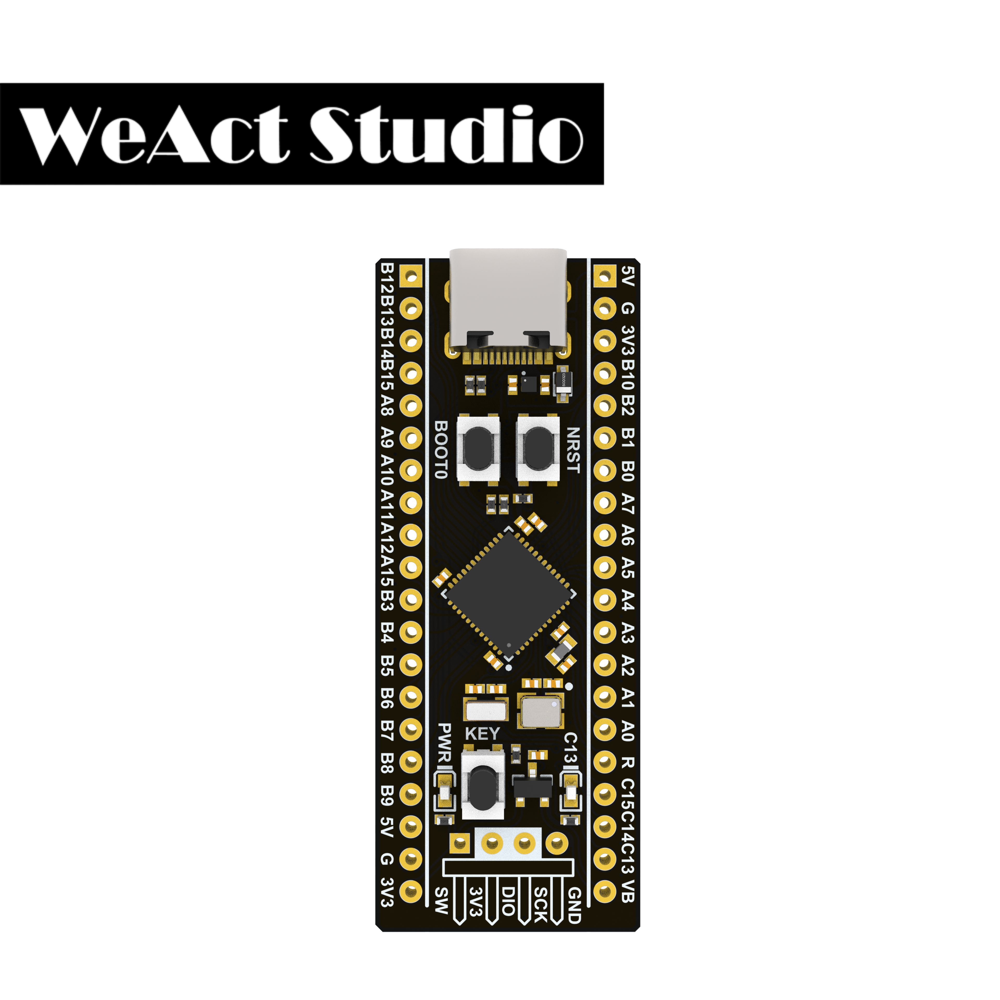
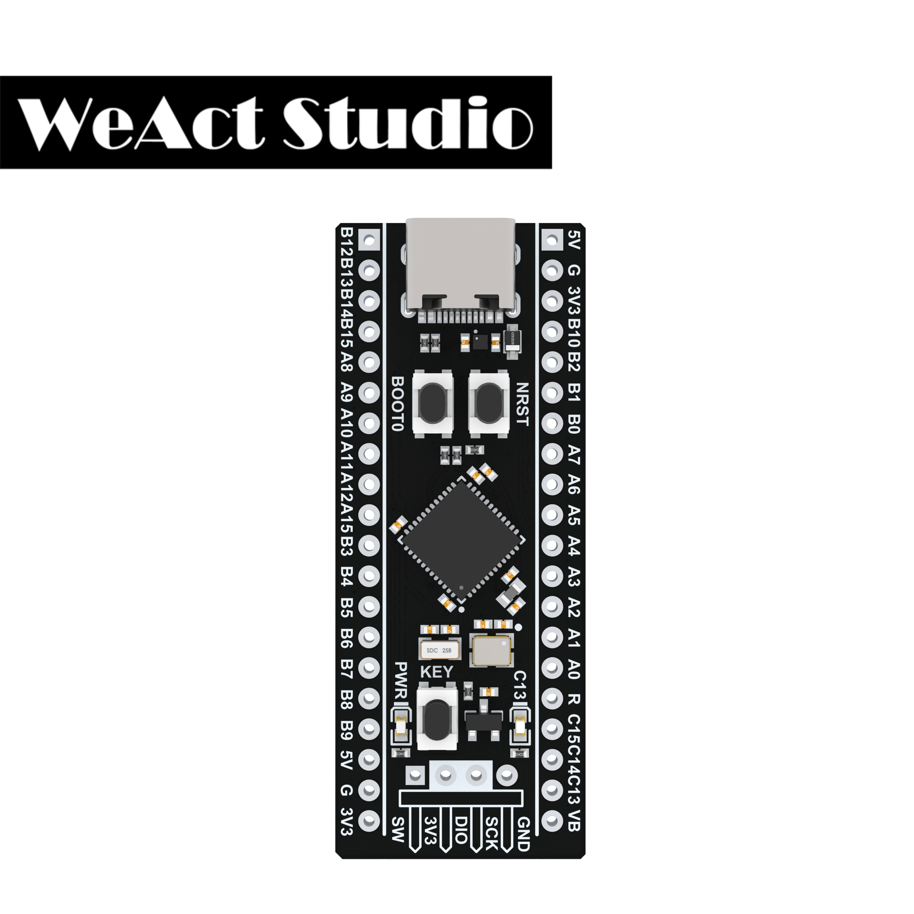
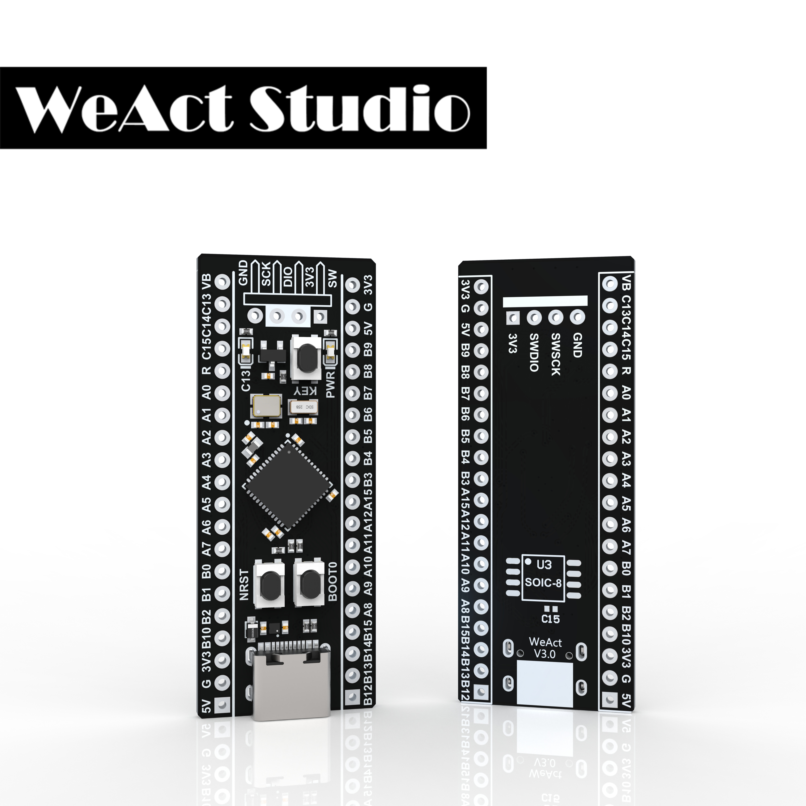

# STM32F4x1 MiniF4 / WeAct Studio 微行工作室 出品

* [中文版本](./README-zh.md)

> `STM32F401CCU6` / `STM32F401CEU6` / `STM32F411CEU6` Core Board

## STM32F411CEU6 Core Board

|Top|Side|Top&Bottom|
|:--:|:--:|:--:|
||||

## STM32F401CEU6 Core Board

|Top|Side|Top&Bottom|
|:--:|:--:|:--:|
|||

To learn more about our studio's other products, please visit[WeAct-Studio-Product](https://github.com/WeAct-TC/WeAct-Studio-Product.git)

## Important note

* Recently, online shopping platforms **have seen a large number of counterfeits**, that is, **pirated copies**. We found that these counterfeits do not have `WeAct` && `version Numbers` on the back.**And the boards are not lead-free, and we all know that lead is bad for you**.The chips are not the **latest batch**, or even **refurbished**.Not only production materials, and production quality closes nevertheless, factory inspection to elaborate (we have a special factory program to test whether each hardware qualified), so that customers in the process of using pirated will appear all sorts of puzzling problem, increase the learning cost, harm the interests of themselves, but also severely damage our `WeAct Studio` product image.

* original is not easy, everyone knows our `WeAct Studio` is the main idea of `a Studio is committed to design unique electronic module`, we create STM32F401, STM32F411 both core board, and we to `micropython CMSIS-DAP` for support, and to the open source community `Arduino` did support, fill the market blank, can make the product easy to develop, and we produce raw materials for the core plate is the best.However, **this good product has been violated by the interest of the business, piracy, copy, inferior products, make us in hot water,** to a certain extent dampened our enthusiasm.But we are still in the spirit of providing a good platform for the majority of electronic fans, we continue to maintain our project, but the maintenance is cost, so we still hope that you can support the legal version, resist piracy, buy legitimate products.Pirated products in use process will appear because of the use of inferior materials in function, affect the development efficiency, the following will give you the original merchants to buy links, and gives the pirated products of cheated (these stores often use a picture of the original, but is really fake goods, do not tally with the picture description).Original is not easy, thank you very much for your support!!

## Legitimate purchase links as well as pirated links

### Taobao legal purchase link

[WeAct Studio official store](https://shop118454188.taobao.com/index.htm?spm=2013.1.w5002-17867322799.2.212f5cb16nqwNP)

### Taobao sells pirated links (beware of being cheated, if you buy by accident, we hope you can report the bad comments, so as not to let others be cheated)

1. ~~[全球易创客空间](https://item.taobao.com/item.htm?spm=a230r.1.14.60.7e3f1465cbQfqs&id=610836924716&ns=1&abbucket=9#detail)~~ 出售盗版,非常严重
2. ~~[深圳市育松电子](https://item.taobao.com/item.htm?spm=a230r.1.14.139.7e3f1465VxCgzT&id=596986293640&ns=1&abbucket=5#detail)~~ Sale of pirated
3. ~~[eixpsy旗舰店](https://detail.tmall.com/item.htm?spm=a230r.1.14.16.12f5a581svM8ak&id=611089230357&cm_id=140105335569ed55e27b&abbucket=8)~~ Sale of pirated
4. ~~[深圳市海瑟威电子商行](https://item.taobao.com/item.htm?spm=a230r.1.14.38.12f5a581svM8ak&id=588648744621&ns=1&abbucket=8#detail)~~ Sale of pirated
5. ~~[佳仕通数码专营店](https://detail.tmall.com/item.htm?spm=a230r.1.14.92.12f5a581svM8ak&id=611294799545&ns=1&abbucket=8)~~ Sale of pirated
6. ~~[瑞仿科技](https://item.taobao.com/item.htm?spm=a1z10.3-c.w4002-12887250463.13.59083066X4aKPg&id=618747430812)~~ Sale of pirated
7. ~~[绿深旗舰店](https://detail.tmall.com/item.htm?spm=a230r.1.14.67.1f455f851IlrO2&id=619121595543)~~ Sale of pirated
8. ~~[芯城兴旗舰店](https://detail.tmall.com/item.htm?id=618685960543)~~ Sale of pirated

### `Aliexpress` legal purchase link

1. [WeAct Studio WeiXing Store](https://www.aliexpress.com/store/910567080)
2. [Sincere Company Store](https://www.aliexpress.com/item/4000346695587.html)

### `Aliexpress` sells pirated links (beware of being cheated, if you buy by accident, we hope you can report negative comments, so as not to let others be deceived)

1. ~~[Global-Purchase Store](https://www.aliexpress.com/item/4000103610226.html)~~ Sale of pirated
2. ~~[WAVGAT Official Store](https://www.aliexpress.com/item/4000084631884.html)~~ Suspected of selling pirated goods, the use of legitimate promotional pictures
3. ~~[WAVGAT authorization Store](https://www.aliexpress.com/item/4000282242626.html)~~ Sale of pirated
4. ~~[AITEXM Store](https://www.aliexpress.com/item/4001098711269.html)~~ Suspected of selling pirated goods, the use of legitimate promotional pictures
5. ~~[Win win.](https://www.aliexpress.com/item/4001049840288.html)~~ Sale of pirated
6. ~~[SZ Aitexm Store](https://www.aliexpress.com/item/4001062944589.html)~~ Sale of pirated
7. ~~[SAMIORE Store](https://www.aliexpress.com/item/4001116395973.html)~~ Sale of pirated
8. ~~[TENSTAR Store](https://www.aliexpress.com/item/4000542455017.html)~~ Sale of pirated
9. ~~[EQV Official Store](https://www.aliexpress.com/item/1005001294256867.html)~~ Sale of pirated
10. ~~[GREAT WALL Electronics Co., Ltd.](https://www.aliexpress.com/item/4001113377360.html)~~ Sale of pirated
11. ~~[GREATZT Store](https://www.aliexpress.com/item/4000109646917.html)~~ Sale of pirated
12. ~~[Great IT electronic components co., LTD](https://www.aliexpress.com/item/4000069263843.html)~~ Sale of pirated
13. ~~[TZT teng Official Store](https://www.aliexpress.com/item/4000112571119.html)~~ Sale of pirated
14. ~~[TZT Official Store](https://www.aliexpress.com/item/4000138305460.html)~~ Sale of pirated
15. ~~[Great IT](https://www.aliexpress.com/item/4000069263843.html)~~ Sale of pirated
16. ~~[All goods are freeshipping Store](https://www.aliexpress.com/item/4000068998794.html)~~ Sale of pirated
17. ~~[All goods are freeshipping Store](https://www.aliexpress.com/item/4000679874594.html)~~ Sale of pirated
18. To be updated

> These pirated merchants publicize pictures and steal genuine products for publicity, and use the information we provide, actually received totally different products and promotional products, screen printing error, using renovation, older chips, inferior material production, customer experience is very poor, please carefully identifying, don't let the noise of their rights and interests receive damage!!!!!!

> None of the boards received without Logo `WeAct` && `version number` are produced by us. If there are any quality problems or technical problems, please find the seller to solve them by yourself. It is best to report them and comment on them, so as not to deceive others!!

> STM32F401 V1.2 `End Of Life` , STM32F411 V1.3 `End Of Life` Since 2019.11.If the online shopping platform is still sold, it is fake!!

> 2020.06 , STM32F401CC V3.0 `End Of Life` , Replace With STM32F401CE V3.0 (84Mhz, 512KB ROM, 96KB RAM).If the online shopping platform still sells STM32F401CCU6, it is fake!!

We do not produce the boards that we received without the Logo `WeAct` && `version number`. If we find that the sellers are selling fake goods, we hope you can send us the issues or send us an email(WeAct_TC@163.com), and we will list the sellers on it, so that more people will not be deceived!!

## We produce boards

* 411 adopts lead-free gold-sinking process, 401 adopts lead-free process, and the needles are gold-plated. All materials conform to ROHS standard, and lead is harmful to health, while piracy USES lead for profit

* All use the latest batch of chips to give customers the best product experience

* 25MHZ high speed crystal vibration & 32.768khz low speed crystal vibration adopt high quality metal shell crystal vibration, the starting effect is better

* Flash disk is reserved to meet the needs of big data storage and microPython. USBDisk&&FATFFS routine is provided

* Support for MicroPython programming with available MicroPython firmware

* Support for Arduino programming, see details[Github](https://www.aliexpress.com/item/4001098711269.html)

* Version V3.0, there are three keys, reset key, BOOT0 key, user key

> We are committed to always use the best raw material, using the latest chips, users get the best user experience, improve the efficiency of development, from the picture we can know is the `014` batches of chips, `The 14th week of 2020`,`is in the middle of march` to make chips, batch is very new, user experience is very good!!!!! But piracy often USES is very ancient vintage chips, such as the recent discovery of piracy is `537` batches of chips, `15 years of production`, `all over the past five years`, **the use of very ancient vintage chips of the most likely problem is through the USB download problem, customer difficult or unable to use the USB to download the program directly**, but this is not the only problems, the user can appear in the process of using all kinds of puzzling problem, directly increase the cost of development, is very deadly!!!!!!

## We produce board packaging

It can be seen from the picture that both the needle arrangement and the board are packaged independently, and the biggest function is to avoid the collision between the inserting needle and the board due to the long-distance transportation of express, which will affect the aesthetics of the board or even the function of the board. Moreover, the bag we use is a self-sealing bag for recycling and environmental protection.But packaging time will be longer and labor costs higher.But the pirated copies sold by the profit merchants are hot-sealed packaging, which means the bags need to be opened with scissors for one-time use，**If the customer received the board with pins in the same bag, then the board is definitely a piracy, please report the business and comment that this is a piracy, so that more people will not be deceived!!**

## The parameters of the board chip we produced are compared

||STM32F401CCU6|STM32F401CEU6|STM32F411CEU6|
|:--:|:--:|:--:|:--:|
|Freq.|84Mhz|84Mhz|100Mhz|
|ROM|256KB|512KB|512KB|
|RAM|64KB|96KB|128KB|
|Sale situation|**discontinued**|In the sale|In the sale|

**STM32F401CCU6** We have stopped production in `2020.6`, if the online shopping platform merchant's promotional materials are still marked **STM32F401CCU6**, then this merchant sells piracy, please do not buy!!
New product `STM32F401CEU6` in the old product `STM32F401CCU6` program is also applicable, but more memory, better performance, shipping price unchanged, and `microPython` perfect support, no need to change any files, can be said to be the cheapest `Pyboard`!!

## Pin distribution diagram

> Thank you for `Richard·Balint` !! 

With the pin allocation diagram, it's easier to work with MicroPython and Arduino!

## MicroPython

* version: V1.12-35

> STM32F401CCU6 `Supported`, STM32F401CEU6 `Supported`, STM32F411CEU6 `Supported`.

### Board Definition

STM32F401CC: `/SDK/STM32F401CCU6/MicroPython/WeAct_F401CC`

STM32F401CE: `/SDK/STM32F401CEU6/MicroPython/WeAct_F411CE`

STM32F411CE: `/SDK/STM32F411CEU6/MicroPython/WeAct_F411CE`

> 中文使用部分教程：[点击](https://www.weact-tc.cn/2020/01/01/micropython/)

> 中文使用部分教程.pdf文件：`/General document/MicroPython部分使用教程 _WeAct工作室.pdf`

## HID Flash

> 中文STM32下载烧录部分教程：[点击](https://www.weact-tc.cn/2019/11/30/STM32Download/)

> 中文STM32下载烧录部分教程.pdf文件：`/General document/STM32部分下载烧录问题汇总 _WeAct工作室.pdf`

> supported in `English` and `Chinese`

### Enter the HID bootloader method:

1. Hold down the \<KEY\>, power on or reset again, and the C13 LED will blink to release
2. APP enters the bootloader reference stm32f401_test_APP 0x8004000.zip project
3. [More instructions](./Soft/WeAct_HID_FW_Bootloader/README.md)

## How to enter ISP mode

* Method 1: When the power is on, press the BOOT0 key and the reset key, then release the reset key, and release the BOOT0 key after 0.5 seconds
* Method 2: When the power is off, hold down the BOOT0 key, and release the BOOT0 at 0.5s after the power is on
* DFU Mode: Use the data line to connect to the computer. If there is an unrecognized problem, you can heat the chip appropriately (25°C) and then re-enter the ISP mode
* Serial Port Mode: Connect PA9 and PA10 of core board with USB serial port
* Soft: STM32CubeProg。

## Chip information

|MCU|Freq.|RAM|ROM|
|:--:|:--:|:--:|:--:|
|STM32F401CC|84Mhz|64KB|256KB|
|STM32F401CE|84Mhz|96KB|512KB|
|STM32F411CE|100Mhz|128KB|512KB|

| STM32F411CE |STM32F401CC|STM32F401CE|
| :--: | :--: | :--: |
||||
|Date Code|Date Code|Date Code|
|014 (2020.06)|End Of Life|934&935 (2020.06)|
|947&002 (2020.03)|609&608|
|946&947 (2020.01)|723 (2020.01)|
|19+ (2019)|16+ (2019)|

### All chips are functional and original

## Board Shape

## High Quality 3D Model Render

### STM32F411 Core Board

|Top|Side|Top&Bottom|
|:--:|:--:|:--:|
||||

### STM32F401 Core Board

|Top|Side|Top&Bottom|
|:--:|:--:|:--:|
||||
