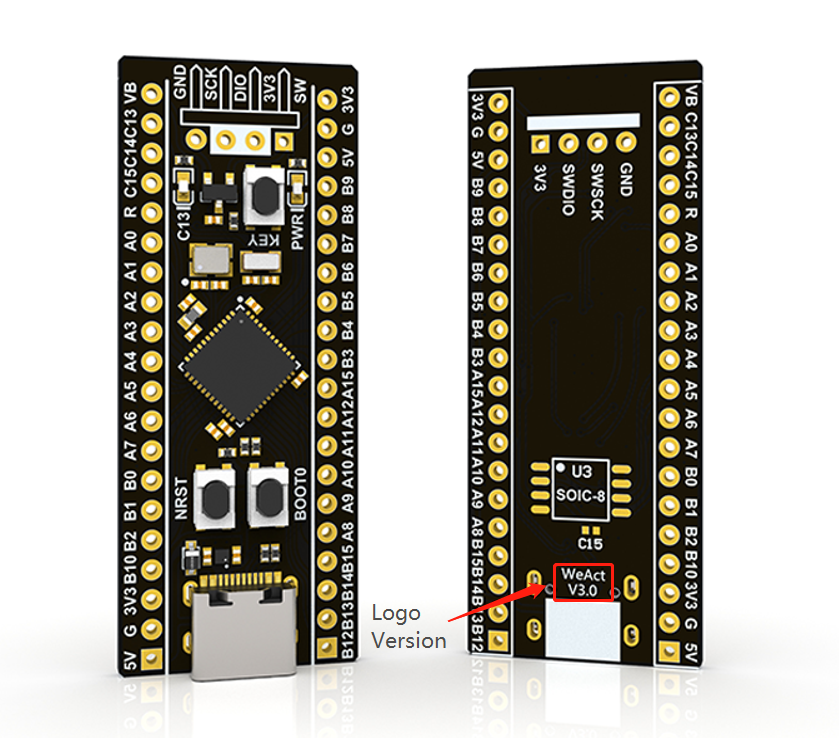
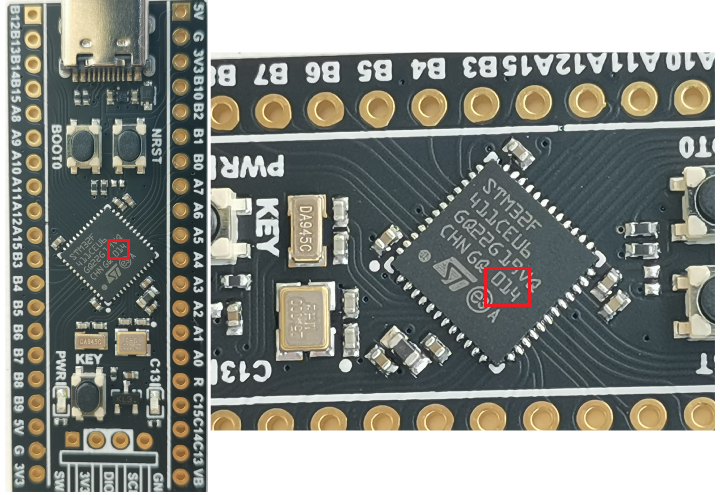
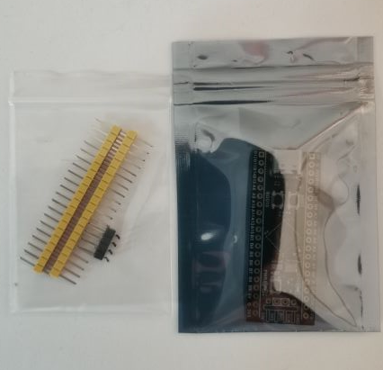
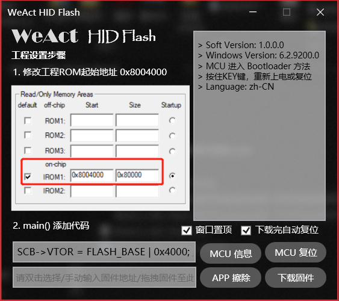
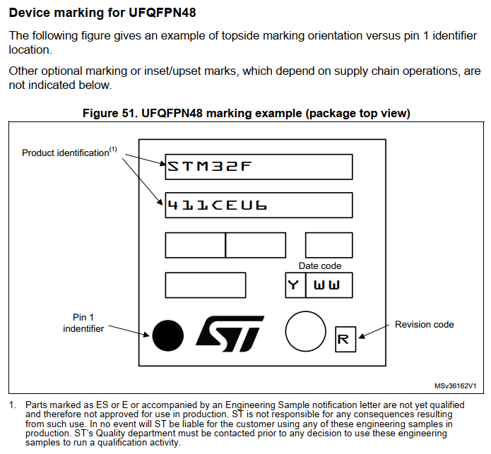
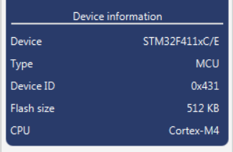
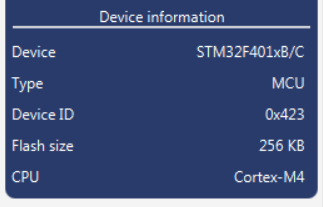
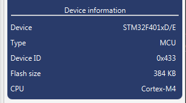
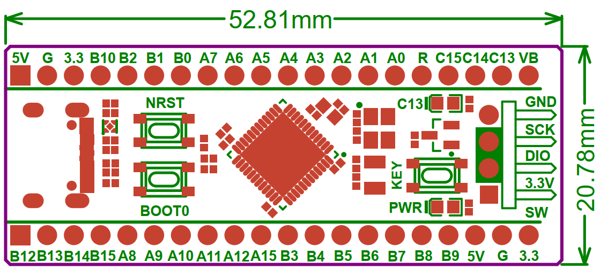

# STM32F4x1 MiniF4 / WeAct Studio 微行工作室 出品

* [中文版本](./README-zh.md)

> `STM32F401CCU6` / `STM32F401CEU6` / `STM32F411CEU6` Core Board

## Where to buy

1. TaoBao [WeAct Studio official store](https://shop118454188.taobao.com/index.htm?spm=2013.1.w5002-17867322799.2.212f5cb16nqwNP)
2. AliExpress [WeAct Studio Official Store](https://weactstudio.aliexpress.com/store/1101545918)

> None of the boards received without Logo `WeAct Studio` && `version number` are produced by us. If there are any quality problems or technical problems, please find the seller to solve them by yourself. It is best to report them and comment on them, so as not to deceive others!!

We do not produce the boards that we received without the Logo `WeAct Studio` && `version number`.

## Our Boards

* 411 adopts lead-free gold-sinking process, 401 adopts lead-free process, and the needles are gold-plated. All materials conform to ROHS standard, and lead is harmful to health, while piracy USES lead for profit

* All use the latest batch of chips to give customers the best product experience

* 25MHZ high speed crystal vibration & 32.768khz low speed crystal vibration adopt high quality metal shell crystal vibration, the starting effect is better

* Flash disk is reserved to meet the needs of big data storage and microPython. USBDisk&&FATFFS routine is provided

* Support for MicroPython programming with available MicroPython firmware

* Support for Arduino programming, see details[Github](https://github.com/stm32duino/Arduino_Core_STM32)

* Version V3.1, there are three keys, reset key, BOOT0 key, user key

> We are committed to always use the best raw material, using the latest chips, users get the best user experience, improve the efficiency of development.

## Our Board Packaging

## The parameters of the board chip we produced are compared

||STM32F401CCU6|STM32F401CEU6|STM32F411CEU6|
|:--:|:--:|:--:|:--:|
|Freq.|84Mhz|84Mhz|100Mhz|
|ROM|256KB|512KB|512KB|
|RAM|64KB|96KB|128KB|
|Sale situation|**discontinued**|**discontinued**|In the sale|

## Pin distribution diagram

> Thanks, `Richard·Balint` !! 

With the pin allocation diagram, it's easier to work with MicroPython and Arduino!

## MicroPython

* version: V1.12-35

> STM32F401CEU6 `Supported`  
STM32F411CEU6 `Supported`.

### Board Definition

STM32F401CE: `/SDK/STM32F401CEU6/MicroPython/WeAct_F411CE`  
STM32F411CE: `/SDK/STM32F411CEU6/MicroPython/WeAct_F411CE`  

## HID Flash

> supported in `English` and `Chinese`

### Enter the HID bootloader method:

1. Hold down the \<KEY\>, power on or reset again, and the C13 LED will blink to release
2. APP enters the bootloader reference stm32f401_test_APP 0x8004000.zip project
3. [More instructions](./Soft/WeAct_HID_FW_Bootloader/README.md)

## How to enter ISP mode

* Method 1: When the power is on, press the BOOT0 key and the reset key, then release the reset key, and release the BOOT0 key after 0.5 seconds
* Method 2: When the power is off, hold down the BOOT0 key, and release the BOOT0 at 0.5s after the power is on
* DFU Mode: Use the data line to connect to the computer. If there is an unrecognized problem, you can heat the chip appropriately (25°C) and then re-enter the ISP mode
* Serial Port Mode: Connect PA9 and PA10 of core board with USB serial port
* Soft: STM32CubeProg。

## Chip information

|MCU|Freq.|RAM|ROM|
|:--:|:--:|:--:|:--:|
|STM32F401CC|84Mhz|64KB|256KB|
|STM32F401CE|84Mhz|96KB|512KB|
|STM32F411CE|100Mhz|128KB|512KB|

| STM32F411CE |STM32F401CC|STM32F401CE|
| :--: | :--: | :--: |
||||
|Date Code|Date Code|Date Code|
|014 (2020.06)|End Of Life|934&935 (2020.06)|
|947&002 (2020.03)|609&608|
|946&947 (2020.01)|723 (2020.01)|
|19+ (2019)|16+ (2019)|

### All chips are functional and original

## Board Shape

