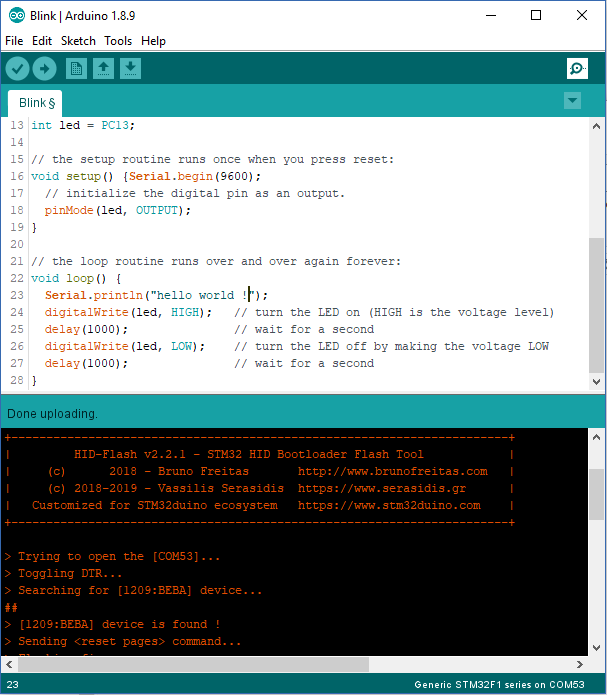

# STM32_HID_bootloader

=============

## Notice

This software is experimental and a work in progress. Under no circumstances should these files be used in relation to any critical system(s). Use of these files is at your own risk.

## THE SOFTWARE IS PROVIDED "AS IS", WITHOUT WARRANTY OF ANY KIND, EXPRESS OR IMPLIED, INCLUDING BUT NOT LIMITED TO THE WARRANTIES OF MERCHANTABILITY, FITNESS FOR A PARTICULAR PURPOSE AND NONINFRINGEMENT. IN NO EVENT SHALL THE AUTHORS OR COPYRIGHT HOLDERS BE LIABLE FOR ANY CLAIM, DAMAGES OR OTHER LIABILITY, WHETHER IN AN ACTION OF CONTRACT, TORT OR OTHERWISE, ARISING FROM, OUT OF OR IN CONNECTION WITH THE SOFTWARE OR THE USE OR OTHER DEALINGS IN THE SOFTWARE

## Summary

This is a driverless (no USB drivers needed, even on Windows) USB HID bootloader
for **STM32F10x** and **STM32F4xx** devices. 

It doesn't use ST libraries since they are bloated and buggy. Only CMSIS and
some required system files and macros have been used from ST provided SDK.

This allowed for a very small bootloader ~~4 KB~~ **2 KB** on `STM32F10x` devices. On `STM32F4xx` devices there is no point to make the bootloader much smaller than 16 KB because the first flash page is already 16 KB.

This repo is based on **bootsector's**  [stm32-hid-bootloader](https://github.com/bootsector/stm32-hid-bootloader) repository but is customized to follows the [Arduino_Core_STM32](https://github.com/stm32duino/Arduino_Core_STM32) Core requirements. The source files (Bootloader and CLI) can be compiled on ***Windows***, ***Linux*** or ***Mac***.

For your convenience, you can find [here](https://github.com/Serasidis/STM32_HID_Bootloader/releases) the **hid-flash** tool for these three platforms and the F1 and F4 firmware binaries.

## Installing the HID bootloader to STM32 devices

### (ST-Link version)

1. Download the [latest HID Bootloader](https://github.com/Serasidis/STM32_HID_Bootloader/releases) release
2. Download the [texane stlink](https://github.com/texane/stlink/releases/tag/1.3.0) according to your operating system (Windows, MacOSX, Linux)
3. Extract the texane stlink to your hard disk. You will need the file ```st-flash``` (it is into the bin folder).
4. Copy into that folder the HID Bootloader file (xxx.bin) according to your board. e.g. ```hid_generic_pc13.bin``` file is for **BluePill** board, ```hid_maple_mini.bin``` is for **Maple Mini** board etc. The on-board LED is connectet to the PC13 pin.
5. Connect ```BOOT-0``` and ```BOOT-1``` pins (or on-board jumpers) to GND ('0' on BluePill board)
6. Type on Windows CMD (or Linux terminal) ```st-flash.exe write hid_generic_pc13.bin 0x8000000``` for programming the HID Bootloader firmware to a **BluePill** board.
7. Apply the ```Arduino_STM32_patch``` from [here](https://github.com/Serasidis/STM32_HID_Bootloader) in case of using Roger's Core (select the zip file according to your Operating System).
8. Select from Arduino IDE ```Tools > Board > [your_stm32_board]```
9. Select  ```Tools > Upload method > HID Bootloader 2.1``` or newer
10. You are ready !

Normally, both ```BOOT-0``` and ```BOOT-1``` must be connected to '0'. If you connect ```BOOT-1``` pin to 3.3V (or '1' on BluePill boards), the board will stay in HID Bootloader mode.  
  
### (Serial Dongle version)

1. Download the [latest HID Bootloader](https://github.com/Serasidis/STM32_HID_Bootloader/releases) release
2. Download the [stm32flash](https://github.com/rogerclarkmelbourne/Arduino_STM32/tree/master/tools) from Roger's Clark Github repo.
3. Extract the stm32flash to your hard disk.
4. Copy into that folder the HID Bootloader file (xxx.bin) according to your board. e.g. ```hid_generic_pc13.bin``` file is for **BluePill** board, ```hid_maple_mini.bin``` is for **Maple Mini** board etc The on-board LED is connectet to the PC13 pin.
5. Set ```BOOT-0``` pin to '1' (3.3V) and reset the board
6. Type on Windows CMD (or Linux terminal) ```stm32flash.exe -g 0x8000000 -b 115200 -w hid_generic_pc13.bin COM2``` or ```stm32flash -g 0x8000000 -b 115200 -w hid_generic_pc13.bin /dev/ttyS0``` for programming the HID Bootloader firmware to a **BluePill** board.
7. Apply the ```Arduino_STM32_patch``` from [here](https://github.com/Serasidis/STM32_HID_Bootloader) in case of using Roger's Core (select the zip file according to your Operating System).
8. Select from Arduino IDE ```Tools > Board > [your_stm32_board]```
9. Select  ```Tools > Upload method > HID Bootloader 2.1``` or newer
10. You are ready !

## CLI folder

`cli` folder contains the source code for creating the command line tool **hid-flash** tool.
This bootloader should't have any compiler restrictions, so it should work with
any GCC ARM toolchain version (latest is always recommended!). Just run 'make' on that folder.

The `hid-flash` binary tool (executable) is also included in the [latest HID Bootloader](https://github.com/Serasidis/STM32_HID_Bootloader/releases) release

### Linux udev setup

To use the HID bootloader without root permissions the following udev rule needs to be installed to the `/etc/udev/rules.d/99-stm32_hid_bl.rules`

``` c
# STM32_HID_bootloader
ATTRS{idProduct}=="beba", ATTRS{idVendor}=="1209", MODE:="666"
```

You might need to reboot or run ```udevadm control --reload-rules``` and replug your device to use it as a normal user after installing.

### Windows examples

```[YOUR_HDD_PATH]\STM32_HID_bootloader\cli>make clean``` Clears the previous generated files
```[YOUR_HDD_PATH]\STM32_HID_bootloader\cli>make``` Creates the **hid-flash.exe** file

## Bootloader folder

`bootloader` folder contains the source code for creating the **hid_bootloader.bin** file that is burned into the STM32F103 flash memory. Currently, only **STM32F103** MCU is supported. Making the ***hid_bootloader.bin***

### Examples

***STM32F10x***

```[YOUR_HDD_PATH]\STM32_HID_bootloader\bootloader\F1>make clean``` Clears the previous generated files
```[YOUR_HDD_PATH]\STM32_HID_bootloader\bootloader\F1>make generic-pc13``` Creates the **hid_bootloader.bin** file, assigning the LED to pin PC13. Edit the ***make_all.bat*** file to see all supported pin options.

If you want to use a ***High Density Device*** such as ***STM32F103RCT6**, then you have to add an extra argument to the ```make``` command.

**Example:** ```[YOUR_HDD_PATH]\STM32_HID_bootloader\bootloader\F1>make generic-pd2 PAGE_SIZE=2048``` Creates the **hid_bootloader.bin** file, assigning the LED to pin PD2. Edit the ***make_all_hd.bat*** file to see all supported pin options.

***STM32F4xx***

```[YOUR_HDD_PATH]\STM32_HID_bootloader\bootloader\F4>make clean``` Clears the previous generated files
```[YOUR_HDD_PATH]\STM32_HID_bootloader\bootloader\F4>make``` Creates the **hid_bootloader.bin** file

After compiling, the binary file can be found in:

```[YOUR_HDD_PATH]\STM32_HID_bootloader\bootloader\F4\build\hid_bootloader.bin```

### Screenshot

<p align="center">

</p>
